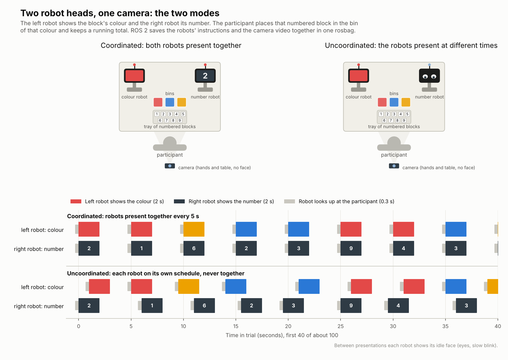

# HRI Project: Two Robot Heads, a Depth Camera and ROS 2

Team: Enrique Feria Abascal, Samin Haque, Sinan Onder. Updated 7 October 2026.

This folder holds the whole project in three files:
- `HRI_Study_Design_ESP32_RobotHeads.docx`: the course study design form.
- This explanation file.
- `HRI_ESP32_Two_Modes.png`: the image below.



## 1. Summary

- Two **robot heads** (ESP32 screens with animated faces, on stands) stand left and right of the participant.
- **Each robot gives its own instruction**: a colour (red or blue) and a number. The participant takes a block with that number from a tray and puts it in the bin of that colour.
  - At most two blocks are open at once (one per robot), and they can be done in **either order**.
  - There are **two bins**: red and blue.
- The participant also keeps a **running mental total** of all numbers. Sorting is the main task.
- An **overhead Intel RealSense depth camera** sees each block land in a bin. The robot that asked for it then glances at that bin, blinks and clears its screen. No tapping is needed; tapping the screen stays as a fallback.
- **Coordinated:** both robots give an instruction at the same moment, every 10 s. **Uncoordinated:** each robot runs on its own irregular schedule and they never give one at the same moment. Both modes have 20 blocks and the same trial length.
- The research question, H1 to H4, NASA-TLX, setup choice, 16 participants and 10-minute sessions stay the same.
- **The camera gives the robots a world model**, not just a recording. The system is:
  - a calibrated workcell;
  - live tracking of every block;
  - robot eyes that follow the participant's hand;
  - automatic fluency measures.

  It is tested like any robotics system, with accuracy and latency. The same stack then carries a follow-up paper with no new hardware (section 8).

## 2. What changed from the last version

| Part | Last version | This version |
|---|---|---|
| What each screen shows | Left: colour only, right: number only (one block split over two robots) | **Each robot shows a full instruction: colour and number** |
| Blocks open at once | One | **Up to two (one per robot), any order** |
| Bins | Three (red, blue, yellow) | **Two (red, blue)** |
| Knowing a block is sorted | Video coded afterwards | **RealSense sees it live; the robot reacts** (tap as fallback) |
| Rhythm | One block every 5 s | Each robot every 10 s, so still one block every 5 s on average |
| Camera | Recording only | Perception that closes the loop, plus optional add-ons (section 8) |

## 3. The setup

```
        [left robot head]      RealSense (overhead,      [right robot head]
        RED 3                  looking down)             BLUE 8
          (on a stand)                                     (on a stand)

                      [ red bin ]         [ blue bin ]

                         [ tray of numbered blocks ]

                                participant
          (optional: 720p webcam between the robots, facing the participant)
```

| Item | Details |
|---|---|
| 2 robot heads | 2 ESP32 boards with colour touch screens on stands at about eye level, each with a simple body and an antenna LED, so they read as robots and not as monitors |
| Depth camera | Intel RealSense **D435** recommended: wide view, and its global-shutter depth sensors cope with moving hands. A D415 or D435i also works (the D435i's IMU is not needed). Mounted about 70 to 80 cm above the table, looking straight down at the tray and the two bins. It sees hands and blocks, not faces. |
| Webcam (optional) | 720p webcam between the robots, facing the participant, for the attention idea in section 8 |
| Blocks | 36 cubes of about 4 cm, numbers 1 to 9, four of each, in a tray, so the choice is never forced |
| Bins | Two shallow bins, red and blue, so blocks stay visible from above |
| Computer | Ubuntu with ROS 2 (Humble or Jazzy), `realsense2_camera`, micro-ROS agent, our scheduler and bin-watcher nodes, rosbag2 |
| Network | Small Wi-Fi router for the ESP32s. Fallback: USB (micro-ROS serial transport) |

## 4. The robots

| State | What the participant sees |
|---|---|
| Idle | Big robot eyes, slow blink, antenna LED blue |
| Look | Eyes move up and look at the participant (0.3 s) |
| Instruction | The screen fills with the colour, a large white number in the middle and small eyes above it, as if the robot is holding a card. Antenna LED red. |
| Watching | While its instruction is open, the robot's eyes follow the participant's hand (R3) |
| Done | Eyes glance toward the bin where the block landed, one blink, back to Idle |
| Timeout | After 6 s without the block, the instruction fades and the robot returns to Idle (counted as missed) |
| Greet and goodbye | "Hi, let's work together" at the start, "Thank you!" at the end |

The robots behave exactly like this in both modes. Only the moments when they give instructions change. The Done reaction is the same whether the block went into the right or the wrong bin, so it gives no feedback on correctness.

## 5. The task

- A robot shows, for example, **RED 3**. The participant takes a **3** from the tray and puts it in the **red** bin.
- If both robots have an open instruction (always in the coordinated mode, sometimes in the uncoordinated mode), the participant does them in **either order**.
- Each robot gives 10 instructions per trial, 20 blocks in total, about 2 minutes. Practice: 10 blocks.
- Running total: all 20 numbers, reported at the end of the trial. In both sequences it is 97.

**Two matched sequences** (the same numbers, 10 red and 10 blue, swapped across conditions):

| Sequence | Left robot | Right robot |
|---|---|---|
| A | Red 3, Blue 8, Red 9, Red 4, Blue 9, Red 7, Blue 3, Red 6, Blue 4, Blue 2 | Red 2, Blue 1, Blue 8, Red 5, Red 1, Blue 4, Red 7, Blue 3, Red 6, Blue 5 |
| B | Red 7, Blue 9, Blue 3, Red 8, Blue 6, Red 5, Red 2, Blue 4, Red 5, Blue 7 | Red 4, Blue 3, Red 4, Blue 3, Red 8, Blue 9, Blue 1, Red 2, Blue 6, Red 1 |

## 6. The two modes

| | Coordinated (synchronous) | Uncoordinated (asynchronous) |
|---|---|---|
| How the robots behave | As a team: both give an instruction at the same moment | Independently: each on its own schedule, never at the same moment (at least 1.5 s apart) |
| Timing | Both robots at 0, 10, 20 ... 90 s | Each robot's own gaps vary from 6 to 14 s (average 10 s); the time between any two instructions varies from 1.5 to 8.5 s |
| Which robot comes next | Both together | Mixed: sometimes left, sometimes right, sometimes the same robot twice in a row |
| Blocks and trial length | 20 blocks, last instructions at 90 s | Same 20 blocks, last instruction at 90 s |
| Faces, reactions, 6 s limit, bins, tray, instructions | Same | Same |

**Instruction times in the uncoordinated mode** (seconds, the same for every participant):

| Instruction | 1 | 2 | 3 | 4 | 5 | 6 | 7 | 8 | 9 | 10 |
|---|---|---|---|---|---|---|---|---|---|---|
| Left robot | 0 | 12 | 18.5 | 25.5 | 35.5 | 49 | 58 | 67 | 75.5 | 85 |
| Right robot | 2 | 10.5 | 23 | 33.5 | 40.5 | 46.5 | 56 | 64.5 | 78.5 | 90 |

Since each robot's gaps are at least 6 s and an instruction closes after at most 6 s, a robot never has two open instructions. That keeps the maximum at two open blocks.

**What the participant experiences:**
- **Coordinated:** two blocks every 10 s, always together, then a calm gap. Easy to plan: "two blocks, do both, wait".
- **Uncoordinated:** the same 20 blocks arrive one at a time, at moments and from sides the participant cannot predict. Sometimes a new one arrives while they are still carrying the last. They have to keep watching both robots.

## 7. Why this is a robotics project and not just HCI

The setup is a small **multi-robot system with a closed sense, think, act loop in ROS 2**:

1. **Sense:** the RealSense watches the bins, the blocks and the hands (and, optionally, the webcam watches the participant's attention). Everything lives in one calibrated coordinate tree (TF) with a live RViz digital twin of the table.
2. **Think:** the task-state node fuses depth, hand and marker data into "block 7 went from the tray to the red bin". The scheduler decides which robot's instruction that completes and when each robot speaks next.
3. **Act:** the robot heads change state and steer their eyes: they look up, show the instruction, follow the hand, glance at the bin and clear.

On top of that:
- **Embodiment:** two robot coworkers with faces, bodies and names in the shared workspace.
- **Social behaviour:** gaze to the participant, gaze to the bin, blinking.
- **Autonomy:** the experimenter only starts the trial.
- **Shared physical work:** real blocks into real bins.
- **Research question:** how coordination *between two robots* affects a human teammate, which is a multi-robot HRI question.

## 8. Camera: course core and paper roadmap

**Principle:** the camera does not just record. It gives the robots a **world model** (where everything is and what the human is doing) that drives their behaviour in a closed loop. We **measure that loop as a system** (accuracy and latency), as any robotics paper would. The course builds and validates this stack, and the follow-up paper reuses it for new robot behaviours. No new hardware is needed.

### Tier 1: course core (the robotics job, all inside the current study)

| # | What | How | Robotics content | What we report |
|---|---|---|---|---|
| **R1** | **Calibrated workcell and digital twin** | ArUco markers on the table corners and the robot stands. OpenCV `solvePnP` gives the camera pose. A static TF tree covers `world`, `camera_link`, `robot_left_head`, `robot_right_head`, `bin_red`, `bin_blue` and `tray`. RViz shows the live table. | Extrinsic calibration, coordinate frames, TF2, visualisation | Calibration error (reprojection error, and measured vs known marker distance) |
| **R2** | **Task-state perception with sensor fusion** | Each block has a small state machine: in tray, in hand, in transit, in bin (red or blue). It fuses the depth landing check per bin, MediaPipe hand position (no events while a hand is over a bin) and ArUco/AprilTag block markers (identity). On landing it sends "done" to the right robot. | Multi-sensor fusion, discrete event estimation, real-time ROS 2 | Detection rate, false events, detection latency against taps, identity accuracy, end-to-end loop latency (target under 300 ms) |
| **R3** | **Perception-driven robot gaze** | The eyes act as a virtual pan-tilt head. The 3D hand point (RealSense deprojection) is transformed into each head's frame with TF. Yaw and pitch are smoothed with a critically damped filter and sent as pupil offsets at about 20 Hz. The eyes follow the hand while the instruction is open, glance at the bin on landing, and look at the participant when giving an instruction. Same in both modes. | Kinematics, frames, closed-loop control of an actuator (the eyes) | Gaze pointing error and update rate |
| **R4** | **Automatic measures and fluency metrics** | From R2 and the hand track, with no manual coding: response time, missed blocks, hesitations (hand pauses over 0.5 s), re-picks, order strategy (which open block is done first). Plus Hoffman's objective fluency metrics: human idle time, robot idle time (instruction open but not started), functional delay (instruction to first hand movement) and concurrent activity. | Perception-based behaviour analytics | Feeds H2, plus a richer answer to "where does the disturbance go" |

**Stretch, if time allows:**
- **R5. Attention tracking (webcam).** MediaPipe Face Landmarker head yaw shows which robot is being looked at. Counting glances between the robots per minute gives a monitoring cost. The robots can return eye contact. Only angles are stored, no face video.
- **R6. Intent prediction (offline from the bags).** Predict the target bin from the hand path after pickup. Report accuracy at 200 ms and 400 ms before landing, with a direction-of-motion rule or logistic regression.

**System validation** (a short test in week 4, plus the pilot, using taps as ground truth) gives the report a technical results section next to the study results: R1 calibration error, R2 detection and latency, R3 gaze error.

### Tier 2: paper roadmap (after the course, same hardware, reusing R1 to R6)

| # | Paper idea | New condition or contribution | Why it is publishable |
|---|---|---|---|
| **P1 (recommended)** | **Human-aware multi-robot turn-taking** | A third coordination policy. A "team manager" node gives the next instruction only when perception says the human is free (hand back at the tray, no open block), alternating robots. Compared with synchronous and asynchronous. | It extends our research question from fixed robot-robot coordination to perception-driven coordination. Novel, measurable with R2 and R4, and needs no new hardware. |
| P2 | **Human-in-the-loop pacing controller** | A feedback controller (PI on open backlog and response time) adjusts the instruction rate to keep the person in a target load zone. | A control-theory angle with the human as the plant; compared with fixed pacing on workload and throughput |
| P3 | **Anticipatory robot gaze** | Using R6, the robot looks at the predicted bin before the block lands. Compared with reactive gaze. | Anticipation and legibility: do robots that "know where you are going" improve fluency? |
| P4 | **Camera-based workload estimation** | Features per 10 s window (hand speed variability, pauses, re-picks, backlog, glance rate) predict TLX and condition. Leave-one-participant-out validation with a small TensorFlow or scikit-learn model. | Non-intrusive workload sensing for adaptive robots, using the course data plus new participants |
| P5 | **Open multimodal dataset** | RGB-D, robot states, hand and head tracks, TLX and events, synchronised in rosbags, with the analysis scripts | A dataset contribution (needs consent for sharing) |
| P6 | **Attention-contingent instructions** | A robot waits until it is looked at (R5), or attracts attention with its eyes, before giving an instruction | Attention-aware multi-robot interaction |

Other follow-ups:
- A "wait" hand gesture that pauses both robots.
- Wrong-bin repair ("oops, wrong bin", using the R2 markers).
- One badly timed robot, testing whether trust spills over to the other.

**Recommended path:** the course delivers R1 to R4 (plus R5 if time allows) and the existing study. The paper is P1, with P4 and P5 as secondary contributions on the same data pipeline.

**Do now so the paper path stays open:**
- **Ethics and consent.** Data collected only "for a course" often cannot be published. Ask the supervisor now about formal ethics approval, and add consent to anonymised reuse for research and publication.
- **Record more** if allowed: colour, aligned depth, hand keypoints, head angles, robot topics and events. If the course requires exactly three topics, record the extras in a second bag per trial.
- **Keep it reproducible:** fixed configs, version-tagged code, and one script from bags to measures.

## 9. Computer vision toolkit (lightweight, laptop CPU)

**Rule of thumb:** no learning where geometry is enough (depth and markers), small pretrained models for people (hands, face), and training only if really needed (block digits).

**Detecting a block landing in a bin (R2)**

| Rank | Tool | What it gives | Cost |
|---|---|---|---|
| 1 | **Depth area check** (numpy on the RealSense depth aligned to colour) | A block-sized height rise inside a bin that stays for 0.3 s. Use the inner bin area and the median, and update the baseline after each event. | Under 1 ms per frame |
| 2 | **RealSense filters** (`pyrealsense2` or `realsense2_camera` parameters: spatial, temporal, hole filling, decimation) | Cleaner depth | Very low |
| 3 | **MediaPipe Hand Landmarker** (21 points per hand) | Knows when a hand is over a bin, so the depth check ignores hands | Real time on CPU |
| 4 | **OpenCV background subtraction** (MOG2 or KNN) on the colour image | Backup change detection, also works with the webcam alone | Very low |

**Knowing which block it was (R2, automatic sorting accuracy)**

| Rank | Tool | Notes |
|---|---|---|
| 1 | **ArUco or AprilTag markers with OpenCV** (`cv2.aruco`, which also reads AprilTag 36h11) | Easiest and close to 100% accurate. The same 2.5 cm marker goes on every face of a cube, and the ID maps to the number. Works in the tray, in the hand and in the bin. Takes 10 to 30 ms per 720p frame. ROS 2: `apriltag_ros` or `ros2_aruco`. |
| 2 | **YOLO11n or YOLOv8n** (Ultralytics), trained on the 9 digits | No markers needed. Needs 200 to 300 labelled images. Roughly 10 to 30 frames per second on a laptop CPU, faster exported to ONNX or OpenVINO. AGPL-3.0 licence. |
| 3 | **MediaPipe Model Maker** (EfficientDet-Lite0, TensorFlow Lite) | The same idea for a TensorFlow workflow; Apache 2.0 |
| Avoid | OCR (EasyOCR, PaddleOCR) | Too heavy for single digits |

**Calibration (R1, once per setup)**
- **Four ArUco markers on the table corners** with OpenCV `findHomography` find the bin and tray areas automatically and give a top-down table frame. This still works if the camera is bumped.
- **RealSense deprojection** (`rs2_deproject_pixel_to_point`) turns pixels plus depth into 3D points in cm.
- Optional: an **Open3D RANSAC plane fit** gives the exact table plane.

**People measures**

| Measure | Tool |
|---|---|
| Hesitations, re-picks, hand paths, movement rhythm, robot gaze target (R3, R4) | **MediaPipe Hand Landmarker** plus depth. A hand slower than a threshold for more than 0.5 s is a pause. A block that leaves the tray and comes back (seen through its marker) is a re-pick. |
| Which robot the participant looks at (R5, webcam) | **MediaPipe Face Landmarker**: head yaw and pitch from its face transform. Store only the angles, not the video. |
| Leaning and reaching (optional) | **MediaPipe Pose Landmarker (lite)** |
| Overall motion and rhythm (optional) | **OpenCV optical flow** (Farneback) or frame differencing; no model needed |
| Keeping block IDs over time (only with YOLO) | **ByteTrack**, built into Ultralytics |

**Recommended minimal stack (all on CPU)**
1. Depth area check plus RealSense filters: a block landed, in which bin, and when.
2. MediaPipe Hands: blocks false triggers from hands, and gives hesitations and hand paths.
3. ArUco or AprilTag markers on the blocks and table corners (OpenCV only): block identity, automatic accuracy and calibration.
4. Optional: MediaPipe Face Landmarker on the webcam for attention between the robots.

- **Python packages:** `pyrealsense2`, `opencv-contrib-python`, `mediapipe`, `numpy`. Optional: `ultralytics`, `open3d`.
- **ROS 2 packages:** `realsense2_camera`, `cv_bridge`, `image_transport` (compressed). Optional: `apriltag_ros` or `ros2_aruco`.
- Each vision node subscribes to the camera and publishes only small results (events and angles). The "done" events go into the two robot topics, so the rosbag keeps its three core topics.

## 10. Screen ideas: keeping the screens robot-like

- **Face first:** the eyes are always visible. Even while showing an instruction, small eyes sit above the card, so it is a robot holding a card, not a display.
- **Gaze:** the robot looks up at the participant before speaking, follows the hand while its instruction is open (R3), and glances at the bin when it sees the block. With R5 it also returns eye contact.
- **Antenna LED** for robot state (blue idle, red waiting for a block), visible from the side.
- **Touch as a robot sense:** tapping the screen means "done". It is the fallback if R2 fails, and in the system validation it is the ground truth for R2 (camera time against tap time).
- **Bodies and names** on the stands; the robots greet and say goodbye.
- **Optional:** one small servo per head so the robot turns toward the participant. This is not needed for the study.

## 11. Research question and hypotheses

**Research question:** Does subjective disturbance show up in objective performance, and if it does not, where does it go?

**Manipulation check:** "The timing of the robots was predictable." and "The two robots felt well coordinated." (7-point scale).

| Hypothesis | Wording |
|---|---|
| H1 Workload | Higher subjective workload in the uncoordinated mode |
| H2 Compensatory behaviour | In the uncoordinated mode, participants respond later and less regularly (longer and more variable response time), miss more blocks, and report more effort |
| H3 Performance | Sorting accuracy stays about the same in both modes; running-sum error increases in the uncoordinated mode |
| H4 Acceptance | Most participants would choose the coordinated robots for a full work shift (binomial test, at least 13 of 16) |

## 12. Measures

**Subjective:** NASA-TLX after each mode, the manipulation check, the setup choice, and two interview questions.

**Objective (all from the ROS 2 recordings):**

| Measure | Definition |
|---|---|
| Sorting accuracy | Instructions completed with the right number in the right bin. Read automatically from the block markers (R2); bin contents are also checked after each trial. |
| Running-sum error | Absolute difference between the reported and the correct total (97) |
| Response time | For each block, from when the participant could start it until the camera sees it in the bin. "Could start" means its instruction appeared, or the previous block was finished if that was later. Mean and variability per trial. |
| Missed blocks | Instructions cleared after 6 s without their block |
| Hesitations (exploratory) | Hand pauses and re-picks (R4) |
| Order strategy (exploratory) | Which open block is done first (R4) |
| Fluency metrics (exploratory) | Human idle time, robot idle time, functional delay, concurrent activity (R4) |
| Monitoring glances (optional) | Glances between the robots per minute (R5) |

**Why "could start":** in the coordinated mode the second block of each pair always waits while the first is handled. Measuring from "could start" removes that built-in wait, so both modes are compared fairly.

## 13. Procedure (about 10 minutes)

1. Consent signed beforehand, including consent to the overhead video (hands and blocks only) and to anonymised reuse for research.
2. Briefing and instructions (1 min). The robots greet the participant.
3. Practice with 10 blocks (1 min).
4. Trial 1 with 20 blocks (2 min), in the counterbalanced order.
5. Manipulation check and NASA-TLX (1.5 min). Meanwhile the experimenter empties the bins into the tray and starts the next recording.
6. Trial 2 with the other mode (2 min).
7. Manipulation check and NASA-TLX (1.5 min).
8. Setup choice, interview and debrief (1 min). The robots say goodbye.

Book 15-minute slots. Recruit 18 for 16 complete participants: 4 groups of 4 (order crossed with sequences A and B).

## 14. ROS 2 setup

**The three required topics, recorded in one rosbag per trial:**

| Topic | Published by | Content |
|---|---|---|
| `/robot_left/screen` | Scheduler, task-state node and gaze node | JSON in `std_msgs/String`, for example `{"seq": 3, "state": "show", "colour": "RED", "number": 4}`, `{"seq": 3, "state": "done", "bin": "RED"}` and `{"gaze": [12.5, -8.0]}` (eye yaw and pitch in degrees, about 20 Hz) |
| `/robot_right/screen` | Scheduler, task-state node and gaze node | The same for the right robot |
| `/camera/color/image_raw` | `realsense2_camera` | Overhead colour video, recorded compressed |

Because the task-state and gaze nodes write into the robot topics, every instruction, every detection and every video frame sits in the same three-topic bag on one clock.

**Nodes:**

| Node | Job |
|---|---|
| `realsense2_camera` | Publishes colour and depth aligned to colour |
| `workcell_calibration` (Python, R1) | Finds the ArUco markers once, computes the camera pose and publishes the static TF tree; RViz shows the digital twin |
| `task_state` (Python, R2) | Fuses the depth landing check, hand position and block markers into each block's state. On landing it sends "done" to the matching robot. |
| `hand_tracker` and `gaze` (Python, R3 and R4) | MediaPipe hand point with depth into a 3D point in TF, then eye angles for each robot |
| `scheduler` (Python) | Reads the participant's group and the timing table; sends look, show and timeout to each robot; keeps track of open instructions |
| `micro_ros_agent` | Bridges the two ESP32s (Wi-Fi or USB) |
| ESP32 firmware | Subscribes to its robot topic and draws the face, card and reactions. On a tap it can report "done" (fallback). |
| `ros2 bag record` | One bag per trial |

**Notes:**
- **Calibration (R1):** ArUco markers on the table corners and robot stands; one script computes the TF tree and the bin areas. Fallback: click the bin corners once and save them in a config file.
- **Second bag for research data:** the three-topic bag satisfies the course. A second bag per trial records aligned depth, hand keypoints, marker detections, `/tf` and (with R5) head angles, so everything can be re-run offline and reused for the paper.

## 15. Analysis plan

| | Measure | Test |
|---|---|---|
| Manipulation check | 2 items | Wilcoxon signed-rank, reported first |
| H1 | Raw NASA-TLX total | Paired t-test, effect size dz |
| H2 | Response time (mean and variability), missed blocks, TLX Effort | Paired t-tests; Wilcoxon for missed blocks |
| H3 | Sorting accuracy, running-sum error | Wilcoxon signed-rank |
| H4 | Setup choice | Exact binomial test (13 of 16) |
| Exploratory | Hesitations, order strategy, fluency metrics, monitoring glances | Descriptive and paired comparisons |
| System validation | R1 calibration error; R2 detection rate, false events, latency, identity accuracy; R3 gaze error | Descriptive (mean, SD, percentiles) |

Tools: pandas, pingouin, scipy, matplotlib, rosbag2 Python reader, and MediaPipe for R3 to R5. With 16 participants a paired t-test detects only large effects (dz about 0.75), so effect sizes are always reported.

## 16. Ethics and data

- The overhead camera records hands, blocks and bins, not faces. The consent form says this, why we record, how long we keep the data and who can see it.
- With R5, face landmarks are processed live and only the head angle is stored.
- **For the paper path:** consent also covers anonymised reuse for research and publication (and sharing, if P5 is planned). Course-only approval is often not enough to publish, so ask for formal ethics approval now.
- Data is stored under participant IDs on university storage and deleted after the project if the course allows.
- Ask the supervisor in week 1 whether the video needs formal ethics approval, and what is needed to publish later.

## 17. Pilot checks (week 4)

1. **Detection (R2):** at least 95% of blocks detected within about 0.3 s of the tap time (participants also tap in the pilot), with no false events from hands, and correct block identity.
2. **Fair limit:** the 6 s limit is fair in the coordinated mode: two blocks fit comfortably.
3. **Difficulty:** the uncoordinated mode feels harder and causes some missed blocks or sum errors. If not, shorten all gaps and keep the same averages.
4. **Readability:** both screens are readable at a glance from the participant's position.
5. **Time:** a full session fits in 10 minutes.

## 18. Timeline (7 October to 13 December 2026)

| Week | Dates | Work | Milestone |
|---|---|---|---|
| 1 | 5 to 11 Oct | Agree on this version. Mount the RealSense, install ROS 2, `realsense2_camera` and micro-ROS. Buy blocks and bins. Ask about ethics. | Design agreed |
| 2 | 12 to 18 Oct | ESP32 faces, card and reactions over micro-ROS. Workcell calibration with ArUco markers, TF tree and RViz twin (R1). First bag with both robots and the camera. Depth landing check in the two bins. | **M1:** a block dropped in a bin makes the right robot react (18 Oct) |
| 3 | 19 to 25 Oct | Task-state node with hands and markers (R2), robot gaze following the hand (R3), scheduler with both timing tables, 6 s limit, greetings, tap fallback. Full dry run. Consent form (with reuse), questionnaires, recruiting outside the HRI course. Decide on stretch items. | **M2:** a full trial runs and records end to end (25 Oct) |
| 4 | 26 Oct to 1 Nov | System validation test (calibration, detection and latency against taps, gaze error). Pilot with 2 to 3 lab members (timing, difficulty). Analysis script with fluency metrics (R4) on the pilot bags. | **M3:** protocol frozen, ethics cleared (1 Nov) |
| 5 to 6 | 2 to 15 Nov | Data collection: 18 participants in 15-minute slots, about 3 afternoons; the rest is buffer. | **M4:** data complete (15 Nov) |
| 7 | 16 to 22 Nov | Analysis: manipulation check, then H1 to H4. | **M5:** results ready (22 Nov) |
| 8 | 23 to 29 Nov | System validation section, exploratory measures (fluency, order strategy, stretch items), figures, methods and results. | |
| 9 | 30 Nov to 6 Dec | Discussion, full draft, slides, short demo video of both modes. | Draft complete (6 Dec) |
| 10 | 7 to 13 Dec | Final edits, rehearsal, presentation and submission. | **M6:** submitted (by 13 Dec) |

**Work split** (names to be assigned):

- **Robots:** ESP32 faces and reactions, micro-ROS, stands.
- **Perception:** RealSense, calibration and TF (R1), task-state node (R2), hand tracking and gaze (R3), stretch items.
- **Study side:** scheduler tables, form, consent, questionnaires, recruiting, pilot, statistics.

## 19. Risks and fallbacks

| Risk | Fallback |
|---|---|
| Hands cause false "block landed" events | Persistence rule (the rise must stay with no hand above the rim); tune in the pilot |
| Depth noise at bin edges | Use only the inner part of each bin and the median depth |
| Bin watcher misses a block | Tap fallback: participants tap the robot's screen when done |
| micro-ROS over Wi-Fi is unstable | USB serial transport |
| Uncoordinated mode not harder in the pilot | Shorter gaps in both modes, same averages |
| Ethics for video takes long | Ask in week 1; the camera sees hands only |
| Robot gaze jitters or lags | Stronger smoothing; lower the update rate to 10 Hz |
| Markers not readable when a block lands at an angle | Same marker on every face; depth still detects the landing; bins checked after each trial |

## 20. Open decisions for the team

1. Camera detection with tap fallback (recommended), or tapping only?
2. Which RealSense: D435 (recommended), D435i or D415?
3. Which stretch items, if any: R5 attention (recommended if time allows) or R6 intent prediction?
4. Robot names, or "left robot" and "right robot"?
5. Is formal ethics approval needed for the video, and for publishing later?
6. Do we record the second research bag (recommended if the paper path is wanted)?
