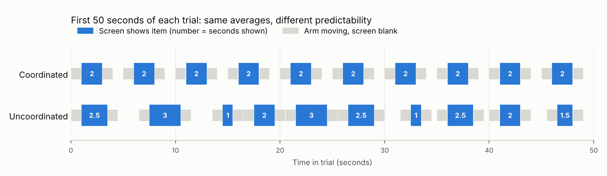

# HRI Project: ESP32 Screen Version (plan, explanation and timeline)

Team: Enrique Feria Abascal, Samin Haque, Sinan Onder. Written 6 October 2026. Replaces the block handover design. The study design form for this version is `docs/HRI_Study_Design_ESP32.docx`.

## 1. The study in one paragraph

One Kinova Gen3 arm holds an ESP32 board with a small screen. It brings the screen in front of a seated participant, the screen shows one item such as **RED 4**, and the participant enters it on a tablet by tapping a colour and a number. The screen goes blank, the arm takes it back, the next item is loaded, and the arm brings it back again. 20 items per trial. In the **coordinated** condition the robot keeps a fixed rhythm (one item every 5 s, screen shown for 2 s). In the **uncoordinated** condition the averages are identical, but the viewing time varies from 1 to 3 s and the time between items varies from 3 to 7 s, so the screen sometimes leaves early and the next item sometimes arrives before the last one is entered. The research question, the four hypotheses, NASA-TLX, the setup choice, 16 participants and 10-minute sessions all stay the same as before.

## 2. The setup

```
            robot side
   [Kinova Gen3 base]
          |
          |  waiting position (screen turned away, about 30 cm further back)
          |
     [ESP32 screen]  viewing position, about 60 cm from the participant's eyes
   ---------------------------------------------- table
          [tablet]
       participant (seated)          researcher at e-stop
```

| Part | Choice | Why |
|---|---|---|
| Robot | One Kinova Gen3, stock ROS 2 driver (`ros2_kortex`) | One arm is enough for this task. The second arm is a spare if the first one faults. |
| Screen | M5Stack Core2 (ESP32, 2.0 inch 320 x 240 screen, battery, case) | Battery and case built in, so no cable runs along the arm. Fallback: ESP32-2432S028R (2.8 inch) with a small power bank if the readability check needs a bigger screen. |
| Mount | 3D-printed cradle with a 40 mm square handle the gripper closes on (or bolted to the tool flange if there is no gripper) | No grasp or release during the task, the gripper only holds the cradle. |
| Participant input | Tablet in a stand, browser page with 4 colour buttons, number buttons 1 to 9, "Undo" and "Missed" | Two taps per item, no spelling errors, every tap timestamped. A touch screen makes the participant look down to enter and look up to read, which is the attention switch the timing manipulation stresses. |
| Network | Small dedicated Wi-Fi router: lab PC (cable), ESP32 and tablet (Wi-Fi) | Keeps the setup off the university network. The arm stays on its own Ethernet link. |
| Item format | Colour word printed in its own colour, number in large white digits, black background | Readable without colour vision, so no colour vision exclusion. |

## 3. How one item works

1. Arm moves from the waiting position to the viewing position (about 1 s). Screen is blank.
2. Arm stops. The PC sends `SHOW <id> RED 4` to the ESP32, the ESP32 draws it and replies `ACK <id>`. The ACK time is the item onset.
3. The screen stays on for the viewing time (2 s, or 1 to 3 s in the uncoordinated condition).
4. The PC sends `BLANK <id>`. Only then does the arm start to move back (about 1 s).
5. The arm waits at the waiting position (1 s, or 0 to 2 s), then the cycle repeats.

The screen is only on while the arm stands still, so the viewing time is set exactly by software and does not depend on arm jitter.



| | Coordinated | Uncoordinated |
|---|---|---|
| Viewing time | 2 s every time | 1, 1.5, 2, 2.5 or 3 s (each 4 times, mean 2 s) |
| Wait at waiting position | 1 s every time | 0, 0.5, 1, 1.5 or 2 s (each 4 times, mean 1 s) |
| Item onset to next onset | 5 s | 3 to 7 s (mean 5 s) |
| Trial length (20 items) | 99 s | 99 s |
| Arm path, speed, poses, screen, items | same | same |

The uncoordinated sequence is generated once by `tools/make_schedules.py` (fixed seed) and is the same for every participant. The script also checks: the first item is shown for at least 2 s, no two 1 s views in a row, at least 4 "tight" items (short view followed by a short wait, which is what creates overlaps), the full 3 to 7 s range is used, and the trial is exactly as long as the coordinated one. The files are in `schedules/`.

**Why the 1 s minimum matters.** Reading "RED 4" takes well under a second once you are looking at it. So a missed item means attention was on the tablet, not that the item was unreadable. The pilot must confirm this (section 8).

## 4. What changed from the block design, and why it is better

| Block design | ESP32 design | Effect |
|---|---|---|
| Two arms hand over physical blocks | One arm shows a screen | No contact with the participant: safer and simpler for ethics. No grasp, release or reload. |
| Pickup moment had to be detected from the gripper | Every tap is logged on the PC | The hardest technical risk (detecting "block taken") is gone. |
| Sorting accuracy would sit near 100% | Accuracy now needs attention, because a screen can leave before you look | Holding accuracy steady in the uncoordinated condition now really costs effort, which is what H3 is about. |
| Running sum as secondary task | No secondary task | The task already loads memory: hold the item until it is entered, sometimes while the next one arrives. Simpler instructions. |
| Pickup latency confounded by being busy | Response time only on "free" items (previous entry finished before the item appeared) | Fair comparison between conditions. |
| Double waits built into the schedule | Overlaps reported as a description only, not as a hypothesis | Avoids a result that is guaranteed by the schedule. |
| Experimenter scored sorting and the total live | Everything comes from logs | No scoring bias, no reload time. |
| Arms maybe too slow for 2 s gaps | Gaps of 3 to 7 s with one arm and 1 s moves | Feasible at safe speeds; the pilot confirms. |

## 5. Decisions made in this version (change any of them if the team disagrees)

1. **One arm.** The new task does not need two, and one arm halves setup, safety and software work.
2. **Tablet with buttons, not typing "Red, 4".** Typing adds spelling errors and noise in response time.
3. **No running sum.** See section 4.
4. **Four colours (red, blue, green, yellow) and numbers 1 to 9.** Each colour 5 times per list; both lists use the same 20 numbers in a different order and pairing.
5. **Screen blank while the arm moves.** Makes viewing time exact.
6. **NASA-TLX before the manipulation check**, so the check questions do not point people to the timing before they rate workload.
7. **Mixed practice:** 5 regular items, then 5 varied ones, so practice does not favour either condition.
8. **One main measure per hypothesis**, named before data collection (section 6). Everything else is exploratory.
9. **Manipulation check items:** "The timing of the robot was predictable." and "The robot gave me enough time to read each item."
10. **Order x list crossing:** 4 groups of 4 participants (`schedules/participants.csv`).

## 6. Measures and analysis

| | Main measure | Also reported (exploratory) | Test |
|---|---|---|---|
| Manipulation check | 2 items, 7-point | | Wilcoxon signed-rank, reported first |
| H1 workload | Raw NASA-TLX total | 6 subscales | Paired t-test, effect size dz |
| H2 compensatory behaviour | Mean response time on free items | SD of response time, Undo count (hesitation), TLX Effort | Paired t-test; Wilcoxon for counts |
| H3 performance | Missed items | Share of entered items that are correct, correct registrations out of 20 | Wilcoxon signed-rank (small counts with many zeros) |
| H4 acceptance | Setup choice | | Exact binomial test against 50%: at least 13 of 16 |
| Description only | Overlaps (new item appeared while the previous entry was unfinished) | | Descriptive |

Definitions used by the analysis notebook:

- **Onset:** ESP32 ACK time after `SHOW`.
- **Entry complete:** time of the second tap (number) of an entry, or the tap on "Missed".
- **Response time:** entry complete minus onset.
- **Free item:** onset is later than the previous entry complete. Only free items count for response time.
- **Overlap:** onset is earlier than the previous entry complete.
- **Matching entries to items:** entries are taken in order. If a participant has fewer entries than items without pressing "Missed", entries are aligned to items by content (a short alignment function in the notebook), and the unmatched items count as missed.

Power: with 16 participants a paired t-test detects dz of about 0.75 at 80% power (24 participants would detect 0.60). H1 is likely to be large; H2 and H3 may not be, so effect sizes are always reported and a non-significant result is not read as "no effect".

## 7. Software plan

All timing runs on one PC clock (`time.monotonic_ns()` in both PC programs, which share the same clock on Linux).

| Piece | What it does | Size |
|---|---|---|
| ESP32 firmware (Arduino, M5Unified) | Joins the Wi-Fi, listens on UDP, handles `SHOW`, `BLANK` and `PING`, replies `ACK <id>` after drawing | about 80 lines |
| `save_pose.py` | Saves the arm's current joint angles as the viewing or waiting pose (move the arm by hand in the Kinova Web App first) | about 20 lines |
| `trial_node.py` (ROS 2, rclpy) | Reads the participant's row and the schedule files, moves between the two poses with `follow_joint_trajectory` (fixed `time_from_start`, no MoveIt), sends `SHOW`/`BLANK`, logs every time | about 150 lines |
| `entry_server.py` + `entry.html` | Serves the tablet page, logs every tap with the PC time | about 120 lines |
| `tools/make_schedules.py` | Item lists, timing, participant groups | done |
| Analysis notebook | Loads logs, matches entries, computes measures, runs the tests | one notebook |

Launch, one arm: `ros2 launch kortex_bringup gen3.launch.py robot_ip:=192.168.1.10 dof:=7 gripper:=robotiq_2f_85 launch_rviz:=false` (set `dof` and `gripper` to the real hardware). Develop with `use_fake_hardware:=true` first.

**Item log (one row per item):** participant, group, condition, list, trial, item index, colour, number, planned view, planned wait, move-in start, arrived at viewing pose, onset (ACK), blank sent, arrived at waiting pose, ACK round trip.

**Tap log (one row per tap):** participant, trial, PC time, button (colour, number, Undo, Missed), entry index, entry complete (yes or no).

## 8. Safety and the pilot

Safety:

- No physical contact in the task. The arm moves only between two taught poses, both on the robot's side of the table. The viewing pose is the closest the arm ever gets, about 60 cm from the participant's face.
- Speed and acceleration limits on, collision detection confirmed active in the control mode the ROS driver uses, Kinova protection zones set so the arm cannot pass the viewing pose.
- Cradle tested by shaking the arm at full speed before any participant. Nothing moves above the participant's head height.
- A researcher stands at the e-stop for the whole robot part.

The pilot (2 to 3 lab members, data never used) must show:

1. The 1 s view is readable when the participant is looking at the screen.
2. The coordinated condition is comfortable, and the uncoordinated condition produces some misses and some overlaps. If nobody misses anything, shorten views and waits (speed up, do not slow down).
3. ACK round trip below about 50 ms and tap logging working.
4. The full session fits in 10 minutes.

## 9. Timeline (6 October to mid-December 2026)

| Week | Dates | Robot and hardware | Software | Study and participants | Milestone |
|---|---|---|---|---|---|
| 1 | 5 to 11 Oct | Order 2 ESP32 screen boards, small Wi-Fi router, tablet stand. Confirm gripper, DoF and firmware. One arm moving with the stock ROS 2 driver. | ROS 2 Humble on the lab PC; fake hardware in Docker on laptops. | Team agrees on the ESP32 design. Send the new form to the supervisor. Ask about ethics approval now. | Design agreed |
| 2 | 12 to 18 Oct | Print and fit the cradle. Teach viewing and waiting poses. Time the moves at safe speed. Set protection zones. | ESP32 firmware; measure the UDP round trip. Re-run `make_schedules.py` with the measured move time if it is not 1 s. | Readability check at 60 cm; pick the font size. | **M1:** arm moves the screen and it shows items (18 Oct) |
| 3 | 19 to 25 Oct | Fix the workstation: table, chair, tablet stand, e-stop position. | `trial_node.py` on fake hardware, then on the real arm. Tablet page and tap logging. Dry run of a full trial. | Write instructions script, consent form, debrief text, questionnaire (TLX, check items, setup choice). Start recruiting outside the HRI course. | **M2:** full trial runs and logs end to end (25 Oct) |
| 4 | 26 Oct to 1 Nov | Final safety check with the supervisor. | Analysis notebook built on pilot logs, including entry matching. | Pilot with 2 to 3 lab members. Tune timing. Book 15-minute slots. | **M3:** protocol frozen, ethics cleared (1 Nov) |
| 5 to 6 | 2 to 15 Nov | Arm on standby; spare arm ready as backup. | Check logs after every session day. | 18 participants in 15-minute slots: about 3 afternoons. The rest is buffer. | **M4:** data complete (15 Nov) |
| 7 | 16 to 22 Nov | Pack down the setup. | Run the notebook: manipulation check first, then H1 to H4. | | **M5:** results ready (22 Nov) |
| 8 | 23 to 29 Nov | Record a short video of the setup for the presentation. | Final figures. | Write methods and results. | |
| 9 | 30 Nov to 6 Dec | | | Discussion, full report draft, presentation slides. Internal review. | Draft complete (6 Dec) |
| 10 | 7 to 13 Dec | | | Final edits, rehearse, present and submit. | **M6:** submitted (by 13 Dec) |

Work split (assign names in the first team meeting):

- **Robot and safety:** arm, poses, cradle, protection zones, workstation, e-stop.
- **Software:** ESP32 firmware, trial node, tablet page, logging, schedules.
- **Study side:** instructions, consent, questionnaires, recruiting, pilot, analysis notebook.

Critical path: ethics approval and M2. If ethics is not cleared by 1 November, data collection moves to 16 to 29 November and weeks 7 and 8 merge. If the arm is not ready by M2, fall back to the Kinova Python API (one script, no ROS) for the trial loop; the rest of the plan does not change.

## 10. Risks and fallbacks

| Risk | Sign | Fallback |
|---|---|---|
| Wi-Fi jitter delays the screen | ACK round trip above 50 ms or unstable | USB cable along the arm (serial instead of UDP) |
| Screen too small or glare | Pilot readers squint or misread at 60 cm | Bigger font, matte film, or the 2.8 inch board |
| Task too easy | No misses in the pilot | Shorter views and waits in both conditions, same averages rule |
| Task too hard | Misses even when looking at the screen | Raise the minimum view to 1.5 s |
| Moves slower than 1 s at safe speed | Timed in week 2 | Regenerate schedules with the real move time; trial gets slightly longer |
| Battery runs out mid-session | Core2 battery is small | Charge between session blocks; USB-C cable as backup |
| Arm fault during data collection | Fault state | Clear faults and restart the trial; spare arm as last resort |

## 11. Still open (settle before the pilot)

- Final screen board after the readability check.
- Real move time of the arm (changes the schedule files, not the design).
- Questionnaire medium: LimeSurvey with 0 to 100 sliders, or paper.
- Whether the course needs formal ethics approval.
- Tablet model and browser (any tablet with a modern browser works).

## 12. Files

| File | What it is |
|---|---|
| `docs/HRI_Study_Design_ESP32.docx` | The study design form for this version (course layout kept) |
| `docs/HRI_ESP32_Plan.md` | This document |
| `docs/img/timing_conditions.png` | The timing figure above |
| `docs/source/HRI_Study_Design_Final_Presentable_blocks.docx` | Previous block version, used as the template |
| `tools/build_form_esp32.py` | Rebuilds the form from the template |
| `tools/make_schedules.py` | Generates `schedules/` |
| `schedules/` | Item lists A, B and practice; timing for both conditions and practice; participant groups |
